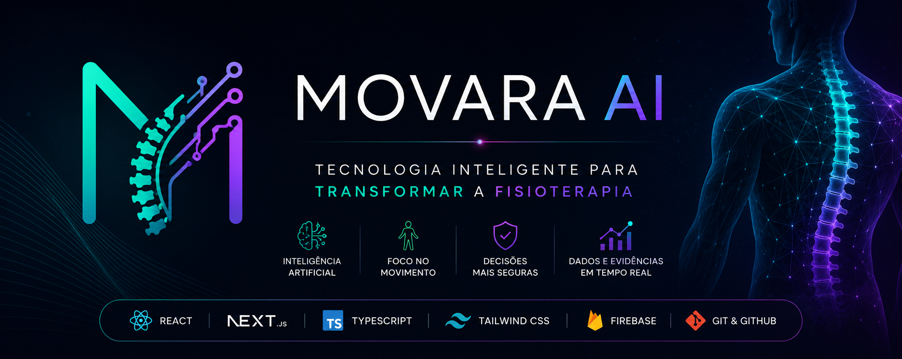

<p align="center">
 
</p>

<p align="center">
  alt="Movara AI">
</p>

<h1 align="center">MOVARA AI</h1>

<p align="center">
<b>Tecnologia Inteligente para Transformar a Fisioterapia</b>
</p>

<p align="center">
Desenvolvido para unir tecnologia, inteligência artificial e fisioterapia em uma única plataforma.
</p>

<p align="center">


</p>

---

# 🎯 Status do Projeto

🚧 Em desenvolvimento ativo.

Este projeto recebe melhorias contínuas conforme minha evolução em Desenvolvimento de Software e Fisioterapia.

---

# 🧠 Sobre o Projeto

O **Movara AI** é uma plataforma web desenvolvida para auxiliar fisioterapeutas na gestão de pacientes, organização de avaliações clínicas e apoio à tomada de decisão.

O projeto nasceu da união entre minha formação em **Fisioterapia** e meus estudos em **Análise e Desenvolvimento de Sistemas**, buscando aplicar tecnologia para tornar a prática clínica mais organizada, eficiente e inteligente.

Além das funcionalidades administrativas, o sistema evolui continuamente para incorporar recursos inteligentes voltados ao suporte do profissional de saúde.

---

# ✨ Funcionalidades

- ✅ Login
- ✅ Cadastro de pacientes
- ✅ Edição de pacientes
- ✅ Exclusão de pacientes
- ✅ Salvamento automático
- ✅ Avaliação clínica
- ✅ Classificação da lombalgia
- ✅ Sugestão inicial de conduta

---

# 🚀 Tecnologias

| Frontend | Linguagens | Ferramentas |
|----------|------------|-------------|
| Next.js | TypeScript | Git |
| React | JavaScript | GitHub |
| Tailwind CSS | HTML5 | VS Code |
| CSS3 | | |

---

# 📂 Estrutura do Projeto

```text
movara-ai
│
├── app
├── public
├── assets
│   ├── banner-readme.jpeg
│   ├── logo-completa.jpeg
│   └── logo-m.jpeg
│
├── package.json
├── tsconfig.json
└── README.md
```

---

# 📸 Telas do Sistema

📷 As imagens da aplicação serão adicionadas conforme novas funcionalidades forem implementadas.

Em breve:

- Tela inicial
- Login
- Cadastro de pacientes
- Avaliação clínica
- Dashboard

---

# 🚧 Roadmap

## Concluído

- [x] Login
- [x] Cadastro de pacientes
- [x] Edição
- [x] Exclusão
- [x] CRUD completo
- [x] Avaliação clínica
- [x] Classificação da lombalgia
- [x] Sugestão inicial de conduta

## Em desenvolvimento

- [ ] Dashboard
- [ ] Firebase
- [ ] Histórico de pacientes
- [ ] Exportação em PDF
- [ ] Responsividade
- [ ] Inteligência Artificial
- [ ] Relatórios
- [ ] Busca inteligente
- [ ] Deploy

---

# 💡 Motivação

Como estudante de **Fisioterapia** e de **Análise e Desenvolvimento de Sistemas**, percebi que muitos processos clínicos ainda podem ser melhorados com tecnologia.

O **Movara AI** nasceu com o propósito de unir essas duas áreas, criando uma ferramenta moderna que auxilie profissionais na organização do atendimento e na tomada de decisão clínica.

Este projeto representa minha evolução como desenvolvedora e continuará recebendo melhorias constantes.

---

# ⚙️ Como executar o projeto

```bash
git clone https://github.com/luana-coelho/movara-ai.git

cd movara-ai

npm install

npm run dev
```

Abra:

```
http://localhost:3000
```

---

# 👩‍💻 Desenvolvedora

## Luana da Silva Coelho Cunha

🎓 Tecnóloga em Análise e Desenvolvimento de Sistemas (em conclusão)

🏥 Graduanda em Fisioterapia

💻 Apaixonada por tecnologia aplicada à saúde.

🐙 GitHub

https://github.com/luana-coelho

💼 LinkedIn

https://linkedin.com/in/luana-coelho-9b5b5270

---

<p align="center">

⭐ Se este projeto foi interessante para você, deixe uma estrela no repositório.

</p>